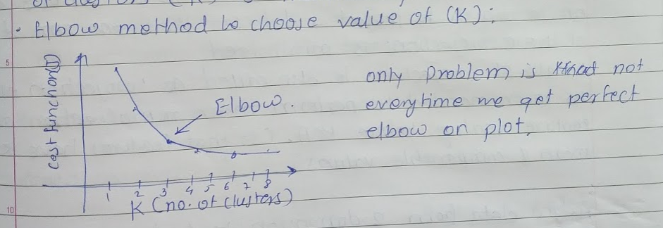

# K Means Clustering
* K Means is unsupervised learning algorith. It is used to find the clusters of data in unlabelled data
* K = No of principal componenet or no of clusters

## How K Means Algorith works
* First steps is to randomly initialize two points and call them centroids
* No of centroids should be equal to no of clusters you want to predict
* Now in 'assignment steps'  K Means algorithm will go through each of the data points and depending on its closeness to the cluster it will assign the data points to a cluster.
* During 'assignment' if there is any centroid who has no data point associated with it, then it can be removed.
* Now in 'move' step  K means algorithm will find the mean of each data point assigned to the cluster centroid and move the respective centroid to the mean value location
* Now alogorith will keep doing the 'assigment' and 'move' steps till the convergance

## Choosing no of clusters (K)
* Mostly K value choosen mannually
* Elbow Method

  
  
## Reference
* Refer my 'Machine-Learning-By-Stanford-University' repository Week: 8 for more details
  [Reference](https://github.com/satishgunjal/Machine-Learning-By-Stanford-University/tree/master/Week_8)
